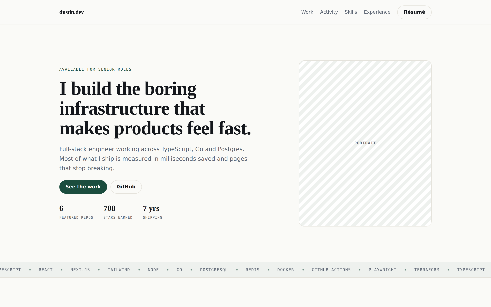

# Portfolio

A portfolio site with a built in theme editor, so the content stays current without a code change.

**Live: [dustin.dev](https://dustin.dev)** · [GitHub](https://github.com/dustin-lee)

<!-- Regenerate on your own machine before pushing: npm run build, npm start, npm run screenshot -->


---

## Why I built it this way

Most portfolios rot. Someone hardcodes six projects into JSX, ships, and never touches it again, because changing a sentence means opening an editor and pushing a commit. Two years later it lists a job they left. The friction is what kills it, and the friction is self inflicted.

They also tend to *describe* engineering rather than be a piece of it. A list of repos with star counts tells a hiring manager little they couldn't get from my GitHub profile faster.

So this site is editable from the browser, and the thing that makes it editable, a Shopify style section editor, is the most substantial piece of work on it. The pitch isn't "look at these repos." It's "the page you're reading is the work sample, and here's the source."

## Goals

* **Keep it current.** Editing is a browser tab, not a deploy.
* **Stay fast on a phone.** Recruiters open links between meetings. Zero JavaScript on the public page, everything served static.
* **Never break while I'm not looking.** No runtime dependency that can take the site down.
* **Be accessible.** Keyboard reachable, real landmarks, WCAG AA contrast on all three themes.
* **Prove it in CI.** Anything that matters gets a check that can fail.

## Stack

| Choice | Why |
|---|---|
| **Next.js 16** (App Router) | Static generation for the public page so there's nothing to render at request time, plus server routes for the editor's save path in one app. |
| **Tailwind v4** | Theme presets are CSS variables, not class swaps, so one attribute recolours the whole site. |
| **dnd-kit** | 6 kB, actively maintained, real keyboard and screen reader support. `react-beautiful-dnd` is abandoned. |
| **Supabase (Postgres)** | Stores the content, but the site never queries it at runtime. Its free tier sleeps after a week of inactivity, which would break the site during exactly the quiet weeks someone reads it cold. A build reads it once and emits static HTML. |
| **Netlify + GitHub Actions** | Deploy previews per pull request, and CI that fails on type errors, test failures, editor code reaching the public bundle, or the public page's JavaScript growing. |
| **Zod** | One schema per section drives the editor controls, the save validation and the TypeScript types, so they can't drift. |

No CMS. Sanity would have been faster and is better software than what I wrote, but then the most impressive part of the project would be a product I configured.

## Performance

| | Score |
|---|---|
| Performance | 100 |
| Accessibility | 100 |
| Best Practices | 96 |
| SEO | 100 |

Lighthouse, desktop preset, production build measured on localhost. The 96 is a blocked webfont request in the sandbox it was run in. Re run against the deployed URL:

```bash
npm run lighthouse --url=https://dustin.dev
```

CI also fails the build if the public page's JavaScript grows past its budget, currently 169 kB gzipped, which is Next 16's floor for a page with no client components.

## Run it locally

```bash
npm install
npm run dev
```

Opens on `localhost:3000`. The editor is at `/studio`. It runs with no environment variables at all, reading content from a committed snapshot, so there's nothing to configure to try it.

```bash
npm run typecheck
npm test          # 28 tests
npm run build
npm run budget    # needs a build first
```

## Trade offs I made on purpose

* **Sections, not a free canvas.** A blank canvas guarantees nothing. A fixed set of good sections means every arrangement is still a good page, and it took weeks instead of months.
* **Publishing takes ~40 seconds**, because the build is what reads the database. Fine for a site that changes monthly. Wrong if I edited hourly.
* **A raw CSS box on every section**, because I can't predict what I'll need at 11pm, and pretending otherwise just means forking the theme later.
* **No analytics, no comments, no newsletter.** Each is something that can break while I'm not watching, for a visitor count that doesn't justify it.

## Where this stops being the right design

* If I start editing daily, build on publish becomes annoying and incremental rendering makes sense.
* If anyone else ever edits it, the single owner assumption breaks throughout and needs rethinking, not patching.
* If the custom CSS boxes fill with hundreds of lines, the theme system is missing real controls and I should add them.

---

Setup, deployment and day to day operation: **[docs/OPERATING.md](docs/OPERATING.md)**
